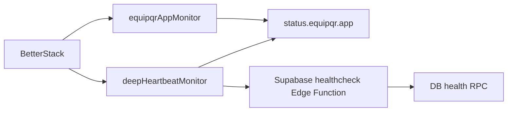

# Better Stack Status Monitoring Plan

**Goal:** Publish a Better Stack-hosted public status page at `status.equipqr.app` and back it with monitors that prove both user-visible uptime and deeper backend health.

**Architecture:** Keep `status.equipqr.app` outside the React SPA. Better Stack will host the public status page and monitor two targets: the production app URL `https://equipqr.app/` for user-visible availability and a new public Supabase edge function at `https://ymxkzronkhwxzcdcbnwq.supabase.co/functions/v1/healthcheck` for deep health. The edge function should call a tiny dedicated SQL RPC rather than query tenant tables directly.

**Tech Stack:** Better Stack Uptime/Status Pages, Supabase Edge Functions (Deno), Supabase SQL migration/RPC, Vercel-managed DNS for `equipqr.app`, Browser MCP for validation.

## Scope And File Map
- Create `[supabase/functions/healthcheck/index.ts](supabase/functions/healthcheck/index.ts)` as a public `GET` endpoint that returns compact JSON and `503` when a dependency fails. Use the shared edge-function helpers in `[supabase/functions/_shared/supabase-clients.ts](supabase/functions/_shared/supabase-clients.ts)` for CORS, JSON responses, and the admin client.
- Modify `[supabase/config.toml](supabase/config.toml)` to add a `[functions.healthcheck]` block with `verify_jwt = false`.
- Create a timestamped SQL migration in `[supabase/migrations](supabase/migrations)` to add a tiny `public.monitoring_healthcheck()` RPC. Follow the existing RPC migration style in `[supabase/migrations/20260115000000_fleet_efficiency_rpc.sql](supabase/migrations/20260115000000_fleet_efficiency_rpc.sql)`.
- Create `[supabase/functions/healthcheck/healthcheck.deno.test.ts](supabase/functions/healthcheck/healthcheck.deno.test.ts)` for the response contract and unhealthy-path behavior.
- Create `[docs/ops/better-stack-monitoring.md](docs/ops/better-stack-monitoring.md)` to document the monitor URLs, Better Stack setup steps, alert policy, and DNS/CNAME steps for `status.equipqr.app`.
- Leave `[src/App.tsx](src/App.tsx)` unchanged; `status.equipqr.app` will be Better Stack-hosted, not a React route.

## Resolved Implementation Decisions
- The edge function should support `OPTIONS` and `GET` only. `OPTIONS` returns the standard CORS preflight response; any non-`GET` method returns `405`.
- Use `createAdminSupabaseClient()`, `createJsonResponse()`, `createErrorResponse()`, and `handleCorsPreflightIfNeeded()` from `[supabase/functions/_shared/supabase-clients.ts](supabase/functions/_shared/supabase-clients.ts)` instead of open-coding request/response helpers.
- The SQL RPC contract should be explicit: `public.monitoring_healthcheck()` returns exactly one row with `ok boolean` and `checked_at timestamptz`, uses `language sql`, `security invoker`, and `set search_path = public`, and does not read tenant tables.
- The HTTP response contract should stay stable for both healthy and unhealthy cases. Return JSON shaped like `{ ok, service, environment, checked_at, checks: { db: { ok, latency_ms, error_code? } } }`, where `service` is the fixed string `"healthcheck"` and `checks.db` is always present.
- On failure, return the same JSON shape with `ok: false`, HTTP `503`, and a short machine-safe `error_code` such as `"rpc_failed"` or `"timeout"`. Do not expose raw SQL errors, stack traces, secrets, project refs beyond the already-public endpoint URL, or tenant data.
- Structure the file so the RPC call/response-building logic can be tested without starting a real server. Export a small handler or `__testables` surface for Deno tests, following the repository's existing function-test pattern.
- The Better Stack documentation must record the actual values chosen during setup: monitor names, target URLs, polling/check interval, alert recipients/escalation notes, status page identifier/title, and the Better Stack-provided CNAME target for `status.equipqr.app`. If any of those values are unavailable during implementation, stop and ask rather than guessing.

## Implementation Tasks
### 1. Add the database-backed heartbeat surface
- Create a minimal SQL RPC that only proves database reachability and returns stable metadata like `ok` and `checked_at`. Keep the body intentionally tiny, for example a single-row `select true, now()`.
- Implement the public edge function so it calls that RPC via the admin client, measures latency, and returns a response like `{ ok, service, environment, checked_at, checks: { db: { ok, latency_ms } } }`.
- Treat a slow or failed dependency check as unhealthy. Add an explicit timeout guard around the RPC call so Better Stack gets a deterministic `503` instead of hanging indefinitely.
- Fail closed: if the RPC errors or times out, return `503` with the same JSON shape and an explicit failed check, without exposing secrets or tenant data.

### 2. Register and test the public health endpoint
- Add the function to `[supabase/config.toml](supabase/config.toml)` with `verify_jwt = false`.
- Add a focused Deno test that covers: healthy `GET`, unhealthy dependency failure or timeout, and non-`GET` method rejection.
- Smoke-test the endpoint locally before touching Better Stack. Verify the local response body matches the documented contract and the local unhealthy path returns `503`.
- After deployment, verify the production URL responds with `200` when healthy before creating or enabling the Better Stack deep-health monitor.

### 3. Provision Better Stack monitoring and the public status page
- Create one Better Stack monitor for `https://equipqr.app/` to represent public web availability.
- Create one Better Stack monitor for `https://ymxkzronkhwxzcdcbnwq.supabase.co/functions/v1/healthcheck` to represent deep application health.
- Create a Better Stack public status page, add both components/monitors, enable uptime history/charts, and configure alert recipients and escalation policy using the real on-call contacts provided for this rollout.
- Point `status.equipqr.app` at the Better Stack-provided CNAME target. If `equipqr.app` DNS is managed in Vercel, do this in the Vercel domain/DNS dashboard rather than in the app repo.
- Record the final Better Stack monitor names, page URL, and CNAME target in `[docs/ops/better-stack-monitoring.md](docs/ops/better-stack-monitoring.md)` so the setup can be reproduced later without reopening the dashboard to rediscover values.

### 4. Validate the full production path
- Confirm Better Stack marks both monitors healthy.
- Open `status.equipqr.app` and verify the custom domain resolves to the Better Stack status page.
- Verify the status page shows the intended components and uptime visibility for reporting.
- Trigger a controlled failure later if desired to prove alerting works end-to-end.

## Acceptance Criteria
- A new SQL migration creates `public.monitoring_healthcheck()` with no tenant-table reads and a stable single-row contract of `ok` and `checked_at`.
- `[supabase/functions/healthcheck/index.ts](supabase/functions/healthcheck/index.ts)` exists, is public, uses the shared helper utilities, accepts `GET`/`OPTIONS` only, and returns `200` when healthy and `503` when the database check fails or times out.
- The health endpoint always returns the documented JSON shape with `checks.db` present in both healthy and unhealthy responses, and does not leak raw backend error details.
- `[supabase/config.toml](supabase/config.toml)` contains a `[functions.healthcheck]` block with `verify_jwt = false`.
- `[supabase/functions/healthcheck/healthcheck.deno.test.ts](supabase/functions/healthcheck/healthcheck.deno.test.ts)` covers at least the healthy contract, one unhealthy path, and wrong-method rejection, and passes locally.
- The health endpoint is smoke-tested locally and the deployed production endpoint returns `200` before Better Stack is pointed at it.
- Better Stack contains two monitors, one public status page, and both monitors are attached to that page.
- `status.equipqr.app` resolves to the Better Stack-hosted status page after DNS propagation.
- `[docs/ops/better-stack-monitoring.md](docs/ops/better-stack-monitoring.md)` documents the final monitor configuration, alert routing choices, status page details, and custom-domain/CNAME setup steps.

## MCP-Assisted Execution Notes
- Vercel MCP can inspect the linked `equipqr` project and confirm current domain/deployment state, but it does not expose DNS mutation for adding the Better Stack CNAME.
- Supabase MCP can inspect the production project and assist with deploying or checking the health function.
- Browser MCP can help drive the Better Stack dashboard and verify the final public page.
- There is no Better Stack-specific MCP server installed here, so Better Stack resource creation itself will be browser-assisted/manual rather than API-driven in this session.