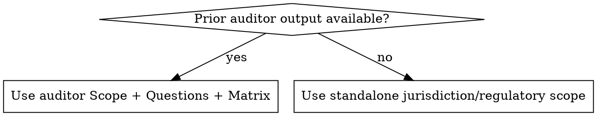

# Inputs

## Input Modes

Use this decision order:

1. **Auditor-driven (preferred)**
2. **Standalone (fallback)**

## Auditor-Driven Mode

When available, ingest:

- `Scope`
- `Audit Questions`
- `Pass-Fail Matrix`

This becomes the evidence checklist.

If jurisdiction overlaps with existing rule packs (for example Texas), preserve the same question ordering used by `auditor` to avoid divergent narratives.

## Standalone Mode

If no prior `auditor` output exists:

- require explicit jurisdiction/regulatory scope
- construct checklist from approved audit rule-pack material
- state assumptions before collecting evidence

## Expected Auditor Output Location

If file-path based handoff is needed, look under:

- `docs/audit-readiness/`

Use the latest user-confirmed artifact as source of truth.

## Missing Input Handling

If neither auditor output nor clear standalone scope is available:

- stop
- request missing scope inputs
- do not collect evidence on an implied scope

## Google Docs Template Design

When the input is a Google Docs pre-audit template that will be copied and filled programmatically:

- **Preferred:** Use unique per-field markers (e.g., `{{TXR-AC-1-STATUS}}`, `{{TXR-AC-1-EVIDENCE}}`). This enables `replaceAllText` to target each field in a single `batchUpdate` call.
- **Fallback:** If the template uses repeated generic labels (`Working Status:`, `Evidence Summary:`), append completed evidence as new sections after the template body. The original template sections serve as the reference; evidence responses are numbered to match.
- Before starting evidence collection, check whether the template uses unique markers or generic labels to choose the correct write strategy.
