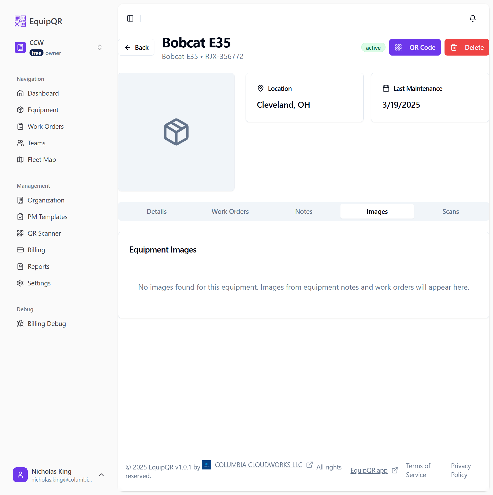
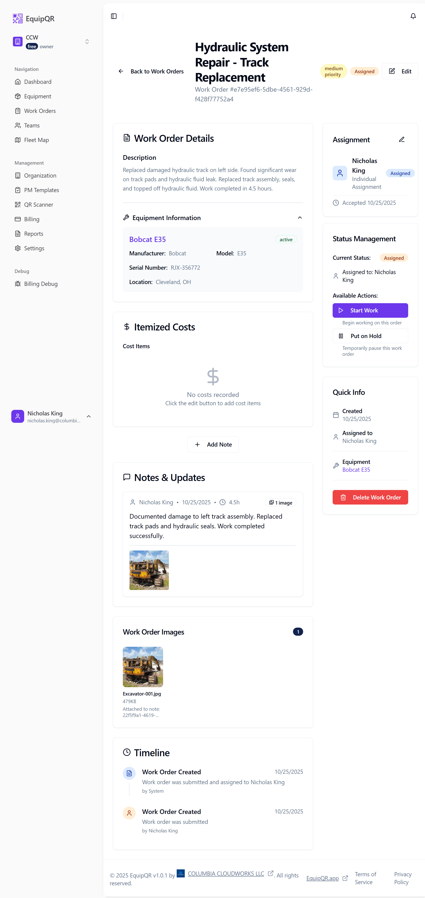

# Technician Guide: Uploading Images to Equipment Records

## Overview

This guide provides step-by-step instructions for technicians on how to upload images to equipment records in EquipQR. Images are uploaded through work orders, which allows for proper documentation of maintenance work, damage assessment, and repair progress.

## Prerequisites

- Access to EquipQR mobile app or web interface
- Equipment QR code scanned or equipment ID available
- Camera or image files ready for upload
- Valid technician account with appropriate permissions

## Step-by-Step Process

### Step 1: Access the Equipment Record

1. **Scan the QR Code** on the equipment using the EquipQR mobile app
2. **Or navigate directly** to the equipment page if you have the equipment ID
3. The equipment page will display basic information about the machine

*Figure 1: Initial equipment page showing basic information*

### Step 2: Create a Work Order

1. Click on the **"Work Orders"** tab in the equipment page
2. Click **"Create Work Order"** or **"Create First Work Order"** button
3. Fill out the work order details:
   - **Title**: Enter a descriptive title (e.g., "Hydraulic System Repair - Track Replacement")
   - **Priority**: Select appropriate priority level
   - **Description**: Provide detailed description of the work needed

*Figure 2: Work order showing uploaded image and note details*

### Step 3: Upload Images with Notes

1. After creating the work order, scroll down to the **"Add Your First Note"** section
2. Fill in the note details:
   - **Note Content**: Describe what you found, what you did, and any important observations
   - **Hours Worked**: Enter the time spent on the work
   - **Private Note**: Toggle if this note should only be visible to you

3. **Upload Images**:
   - In the **"Images (Optional)"** section, click **"Choose Files"**
   - Select one or more images from your device
   - Supported formats: JPEG, PNG, GIF, WebP (up to 10MB each)
   - You can drag and drop images or click the button

*Figure 3: Work order details view showing image upload functionality*

4. **Review selected images** - you'll see a preview of selected files
5. Click **"Upload X Image(s)"** to upload the images with your note

### Step 4: Verify Upload Success

1. After uploading, you'll see the note appear in the **"Notes & Updates"** section
2. The note will show:
   - Your name and timestamp
   - Hours worked (e.g., "4.5h")
   - Image indicator (e.g., "1 image")
   - Your note content
   - The uploaded image(s)

3. The **"Work Order Images"** section will display all uploaded images with:
   - Image preview
   - File name and size
   - Note attachment reference

*Figure 4: Complete work order view showing uploaded image and note details*

## Best Practices for Image Documentation

### What to Photograph

- **Before Work**: Document the initial condition, damage, or issue
- **During Work**: Show parts being replaced, tools used, or work in progress
- **After Work**: Document the completed repair or maintenance
- **Parts**: Photograph part numbers, serial numbers, or model information
- **Safety Issues**: Document any safety concerns or hazards found

### Image Quality Tips

- **Good Lighting**: Ensure adequate lighting for clear photos
- **Stable Shots**: Hold the camera steady or use a tripod
- **Multiple Angles**: Take photos from different angles when documenting damage
- **Close-ups**: Get detailed shots of specific issues or parts
- **Wide Shots**: Include context shots showing the overall area

### File Management

- **File Size**: Keep images under 10MB each for faster upload
- **File Names**: Use descriptive names if possible (e.g., "left-track-damage.jpg")
- **Multiple Images**: Upload multiple images in a single note for related work

## Troubleshooting

### Common Issues

**Image Won't Upload**
- Check file size (must be under 10MB)
- Verify file format (JPEG, PNG, GIF, WebP only)
- Ensure stable internet connection

**Images Not Appearing**
- Refresh the page and check again
- Verify the note was created successfully
- Check if images are still processing

**Poor Image Quality**
- Ensure adequate lighting
- Clean camera lens
- Hold device steady while taking photos

### Getting Help

If you encounter issues:
1. Check your internet connection
2. Try uploading a smaller image file
3. Contact your supervisor or IT support
4. Check the EquipQR help documentation

## Security and Privacy

- **Private Notes**: Use the "Private Note" toggle for sensitive information
- **Image Content**: Ensure images don't contain sensitive personal information
- **Company Policy**: Follow your organization's image and documentation policies

## Summary

Uploading images to equipment records through work orders provides:

- **Complete Documentation**: Visual record of work performed
- **Progress Tracking**: Before, during, and after photos
- **Knowledge Sharing**: Other technicians can see previous work
- **Quality Assurance**: Supervisors can review work quality
- **Compliance**: Meets documentation requirements for maintenance records

Remember: Images uploaded through work orders will appear in the equipment's Images tab, providing a centralized view of all visual documentation for that piece of equipment.

---

*This guide is part of the EquipQR documentation system. For additional help or feature requests, contact your system administrator.*
