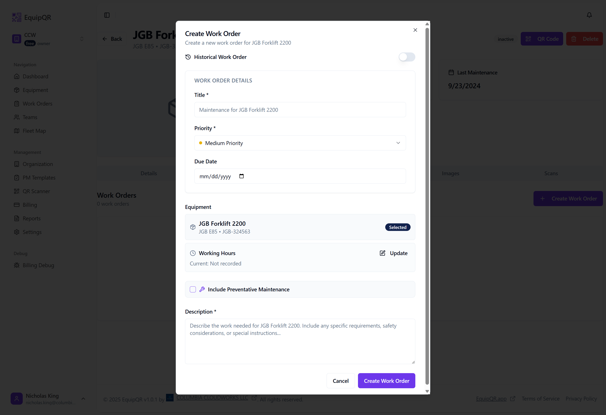
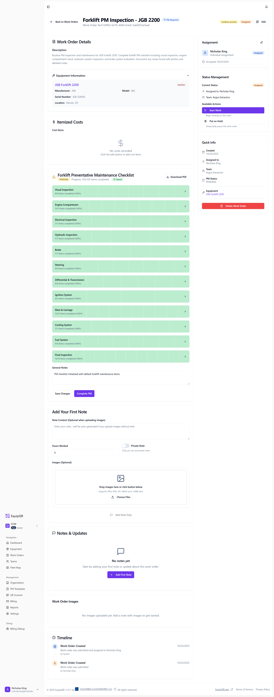
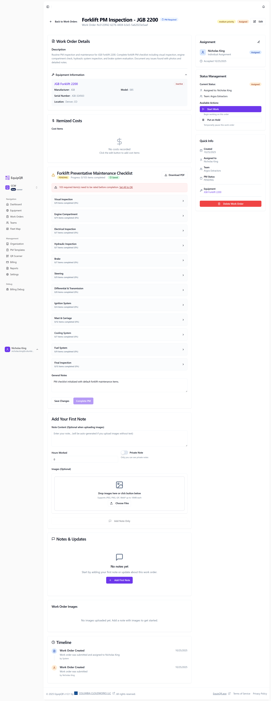
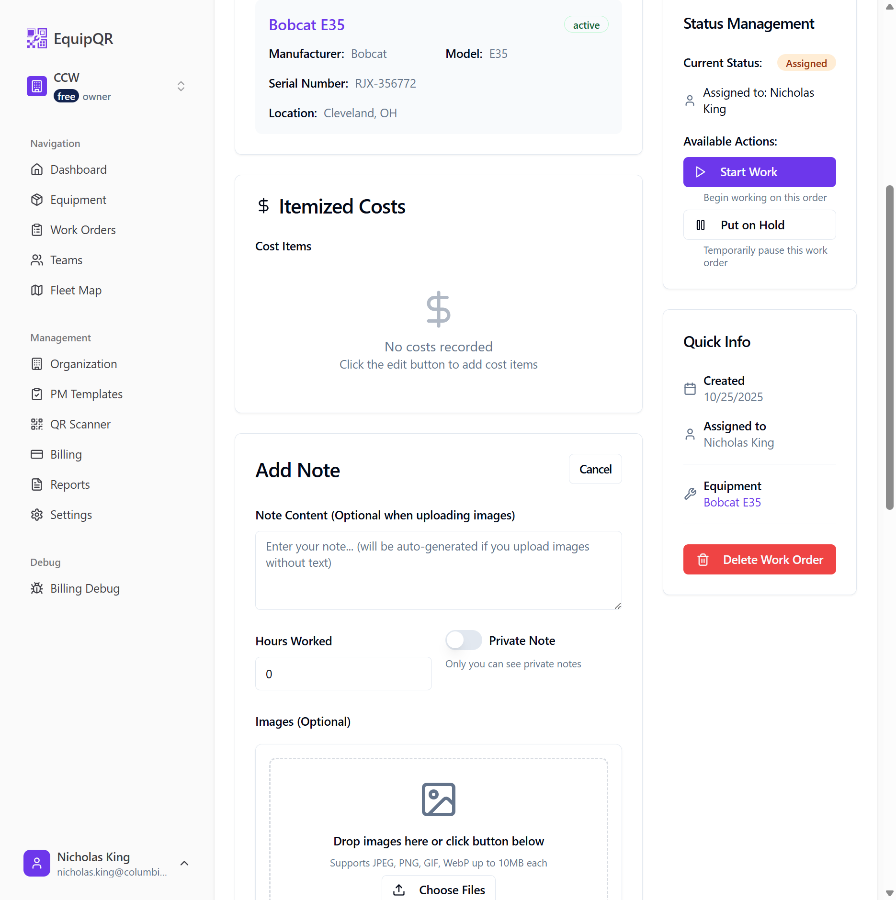
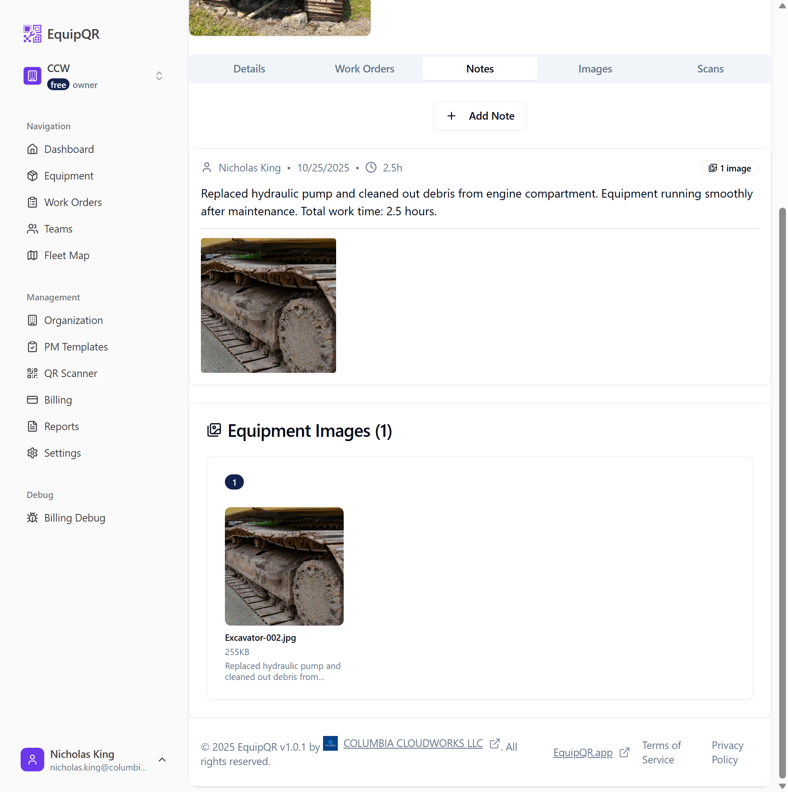

# Workflows Guide

This guide covers work order workflows and image upload processes in EquipQR, providing comprehensive instructions for technicians and managers.

## Work Order Workflow

### Overview

Work orders are the primary mechanism for tracking maintenance and repair activities across the equipment fleet. This section outlines the complete work order lifecycle, creation methods, status management, and assignment processes.

### Work Order Lifecycle

#### Status Flow

Work orders progress through a defined lifecycle with the following statuses:

1. **Submitted** - Initial state when a work order is created
2. **Accepted** - Work order has been reviewed and approved
3. **Assigned** - Work order has been assigned to a specific technician
4. **In Progress** - Active work has begun on the order
5. **On Hold** - Work has been temporarily paused
6. **Completed** - All work has been finished successfully
7. **Cancelled** - Work order has been terminated without completion

#### Status Transitions

| Current Status | Possible Next States | Who Can Change | Notes |
|---------------|---------------------|----------------|-------|
| Submitted | Accepted, Cancelled | Manager, Admin, Owner | Initial review stage |
| Accepted | Assigned, Cancelled | Manager, Admin, Owner | Ready for assignment |
| Assigned | In Progress, On Hold, Cancelled | Manager, Admin, Owner, Assigned Technician | Work can begin |
| In Progress | Completed, On Hold, Cancelled | Manager, Admin, Owner, Assigned Technician | Active work phase |
| On Hold | In Progress, Cancelled | Manager, Admin, Owner, Assigned Technician | Resume or terminate |
| Completed | (Final State) | - | Work finished |
| Cancelled | (Final State) | - | Work terminated |

### User Roles and Permissions

#### Organization-Level Roles

**Owner**
- **Scope**: Full access across organization
- **Capabilities**: 
  - Create, view, edit, delete any work order
  - Change any work order status
  - Assign work orders to any team or individual
  - Access all work order data and reports

**Admin**
- **Scope**: Organization-wide management
- **Capabilities**:
  - Create, view, edit, delete any work order
  - Change any work order status
  - Assign work orders to any team or individual
  - Access all work order data and reports
- **Limitations**: Cannot change organization ownership

**Member**
- **Scope**: Limited organization access
- **Capabilities**:
  - Create work orders
  - View work orders they created or are assigned to
  - View work orders for their teams
- **Limitations**: Cannot manage work order assignments or organization settings

#### Team-Level Roles

**Manager**
- **Scope**: Team-specific management
- **Capabilities**:
  - Create work orders
  - Assign work orders to team members
  - Change status of team work orders
  - View all team work orders
  - Manage team member assignments

**Technician**
- **Scope**: Execution-focused
- **Capabilities**:
  - Create work orders
  - Update status of assigned work orders
  - View assigned work orders and team work orders
  - Record work completion
- **Limitations**: Cannot assign work orders to others

**Requestor**
- **Scope**: Request submission
- **Capabilities**:
  - Create work orders
  - View work orders they created
  - View team work orders (read-only)
- **Limitations**: Cannot modify work orders after submission

**Viewer**
- **Scope**: Read-only access
- **Capabilities**:
  - View team work orders
- **Limitations**: Cannot create or modify work orders

### Work Order Creation Methods

#### 1. Direct Creation
- **Access**: Main Work Orders page (`/work-orders`)
- **Button**: "Create Work Order" button
- **Process**:
  1. User clicks "Create Work Order"
  2. WorkOrderForm modal opens
  3. User fills required fields (title, description, equipment)
  4. Optional fields: priority, assignee, team, due date, estimated hours
  5. Form submission creates work order with "Submitted" status

#### 2. Equipment-Specific Creation
- **Access**: Equipment Details page (`/equipment/{id}`)
- **Location**: Work Orders tab
- **Process**:
  1. User navigates to specific equipment
  2. Clicks "Create Work Order" in Work Orders tab
  3. WorkOrderForm opens with equipment pre-selected
  4. Equipment field is locked and cannot be changed
  5. Form shows context-specific placeholder text

#### 3. QR Code Scanning
- **Access**: QR Scanner page (`/scanner`) or mobile scanning
- **Process**:
  1. User scans equipment QR code
  2. Redirected to equipment details page
  3. Can create work order from equipment context
  4. Equipment information auto-populated

### Work Order Assignment System

#### Assignment Methods

**Individual Assignment**
- **Who Can Assign**: Owners, Admins, Team Managers
- **Process**:
  1. Select assignee from dropdown in work order form
  2. Assignee receives notification (when implemented)
  3. Work order appears in assignee's "My Work Orders" view
  4. Status can be updated to "Assigned"

**Team Assignment**
- **Who Can Assign**: Owners, Admins, Team Managers
- **Process**:
  1. Select team from dropdown in work order form
  2. All team members can view the work order
  3. Team manager can reassign to specific team member
  4. Work order appears in team's work queue

#### Assignment Rules
- Work orders can be assigned to individuals, teams, or both
- Individual assignment takes precedence for status updates
- Team managers can reassign within their team
- Unassigned work orders remain in "Submitted" or "Accepted" status

### Status Management

#### Automated Status Changes
- **Creation**: New work orders start with "Submitted" status
- **Assignment**: Status can be changed to "Assigned" when assignee is set
- **Completion**: Status changes to "Completed" when marked by authorized user

#### Manual Status Updates
- **Access**: Work Order Details page status management panel
- **Interface**: Status-specific action buttons (Accept, Assign, Start Work, Complete, etc.)
- **Validation**: System shows only valid next status options based on current state

#### Status Change Permissions
```
Submitted → Accepted: Manager+
Accepted → Assigned: Manager+
Assigned → In Progress: Manager+ or Assigned Technician
In Progress → Completed: Manager+ or Assigned Technician
Any → On Hold: Manager+ or Assigned Technician
Any → Cancelled: Manager+
```

## Image Upload Workflow

### Overview

This section provides step-by-step instructions for technicians on how to upload images to equipment records in EquipQR. Images are uploaded through work orders, which allows for proper documentation of maintenance work, damage assessment, and repair progress.

### Prerequisites

- Access to EquipQR mobile app or web interface
- Equipment QR code scanned or equipment ID available
- Camera or image files ready for upload
- Valid technician account with appropriate permissions

### Step-by-Step Process

#### Step 1: Access the Equipment Record

1. **Scan the QR Code** on the equipment using the EquipQR mobile app
2. **Or navigate directly** to the equipment page if you have the equipment ID
3. The equipment page will display basic information about the machine


*Figure 1: Initial equipment page showing basic information*

#### Step 2: Create a Work Order

1. Click on the **"Work Orders"** tab in the equipment page
2. Click **"Create Work Order"** or **"Create First Work Order"** button
3. Fill out the work order details:
   - **Title**: Enter a descriptive title (e.g., "Hydraulic System Repair - Track Replacement")
   - **Priority**: Select appropriate priority level
   - **Description**: Provide detailed description of the work needed


*Figure 2: Creating a new work order*

#### Step 3: Upload Images with Notes

1. After creating the work order, scroll down to the **"Add Your First Note"** section
2. Fill in the note details:
   - **Note Content**: Describe what you found, what you did, and any important observations
   - **Hours Worked**: Enter the time spent on the work
   - **Private Note**: Toggle if this note should only be visible to you

3. **Upload Images**:
   - In the **"Images (Optional)"** section, click **"Choose Files"**
   - Select one or more images from your device
   - Supported formats: JPEG, PNG, GIF, WebP (up to 10MB each)
   - You can drag and drop images or click the button


*Figure 3: Uploading images with detailed notes*

4. **Review selected images** - you'll see a preview of selected files
5. Click **"Upload X Image(s)"** to upload the images with your note

#### Step 4: Verify Upload Success

1. After uploading, you'll see the note appear in the **"Notes & Updates"** section
2. The note will show:
   - Your name and timestamp
   - Hours worked (e.g., "4.5h")
   - Image indicator (e.g., "1 image")
   - Your note content
   - The uploaded image(s)

3. The **"Work Order Images"** section will display all uploaded images with:
   - Image preview
   - File name and size
   - Note attachment reference


*Figure 4: Complete work order view showing uploaded image and note details*

#### Step 5: Set Display Image for Equipment

1. After uploading images, go to the **"Images"** tab in the equipment page
2. Find the image you want to use as the main display image
3. Click the **"Set as Display Image"** button on the desired image
4. The image will now appear as the main equipment photo


*Figure 5: Setting an image as the equipment display photo*

### Working with PM Checklists

#### Step 6: Create a PM Checklist Work Order

1. When creating a work order, check the **"Include PM Checklist"** option
2. Select a PM template (e.g., "Forklift PM Checklist")
3. The work order will include a comprehensive maintenance checklist


*Figure 6: Creating a work order with PM checklist*

#### Step 7: Complete PM Checklist Items

1. In the work order details, scroll to the **"PM Checklist"** section
2. Click **"Set All to OK"** to quickly mark all items as acceptable
3. For items that need attention:
   - Select the appropriate status (Needs Attention, Critical, etc.)
   - Add detailed notes explaining the issue
   - Upload photos showing the problem


*Figure 7: Completing PM checklist items with notes and photos*

#### Step 8: Save Progress

1. Click **"Save Changes"** after updating checklist items
2. The system will auto-save your progress
3. You can return to the checklist later to continue work


*Figure 8: Saving PM checklist progress*

### Managing Work Order Status

#### Step 9: Update Work Order Status

1. In the work order details, find the **"Status"** section
2. Click the status dropdown to change the work order status:
   - **Pending**: Work order created but not started
   - **In Progress**: Work is currently being performed
   - **Completed**: All work finished
   - **Cancelled**: Work order cancelled


*Figure 9: Updating work order status*

### Adding Items and Costs

#### Step 10: Add Parts and Costs

1. In the work order details, scroll to the **"Costs"** section
2. Click **"Add Item"** to add parts or services
3. Fill in the details:
   - **Item Name**: Name of the part or service
   - **Quantity**: Number of items used
   - **Unit Cost**: Cost per item
   - **Description**: Additional details


*Figure 10: Adding parts and costs to work order*

### Private Notes

#### Step 11: Add Private Notes

1. When adding a note, toggle the **"Private Note"** option
2. Private notes are only visible to you and other technicians
3. Use private notes for:
   - Internal observations
   - Personal reminders
   - Sensitive information


*Figure 11: Adding private notes that customers won't see*

### Viewing All Equipment Images

#### Step 12: Access Equipment Image Gallery

1. Go to the **"Images"** tab in the equipment page
2. View all images uploaded through work orders and equipment notes
3. Images are organized by date and source
4. Click on any image to view it in full size


*Figure 12: Viewing all equipment images in the gallery*

## Best Practices

### For Work Order Creation
1. **Clear Titles**: Use descriptive, specific work order titles
2. **Detailed Descriptions**: Provide comprehensive work instructions
3. **Appropriate Priority**: Set priority based on urgency and impact
4. **Realistic Estimates**: Provide accurate time estimates when possible
5. **Equipment Context**: Create work orders from equipment pages when possible

### For Managers
1. **Timely Review**: Review and accept/reject submitted work orders promptly
2. **Appropriate Assignment**: Assign work to qualified technicians
3. **Resource Planning**: Consider team workload when assigning
4. **Progress Monitoring**: Regularly check work order status and progress
5. **Documentation**: Ensure proper completion documentation

### For Technicians
1. **Status Updates**: Keep work order status current
2. **Clear Communication**: Document any issues or complications
3. **Timely Completion**: Complete work within estimated timeframes
4. **Quality Assurance**: Verify work completion before marking as done
5. **Safety Compliance**: Follow all safety procedures during work

### Image Upload Best Practices

#### What to Photograph
- **Before Work**: Document the initial condition, damage, or issue
- **During Work**: Show parts being replaced, tools used, or work in progress
- **After Work**: Document the completed repair or maintenance
- **Parts**: Photograph part numbers, serial numbers, or model information
- **Safety Issues**: Document any safety concerns or hazards found

#### Image Quality Tips
- **Good Lighting**: Ensure adequate lighting for clear photos
- **Stable Shots**: Hold the camera steady or use a tripod
- **Multiple Angles**: Take photos from different angles when documenting damage
- **Close-ups**: Get detailed shots of specific issues or parts
- **Wide Shots**: Include context shots showing the overall area

#### File Management
- **File Size**: Keep images under 10MB each for faster upload
- **File Names**: Use descriptive names if possible (e.g., "left-track-damage.jpg")
- **Multiple Images**: Upload multiple images in a single note for related work

## Troubleshooting

### Common Work Order Issues

1. **Permission Denied**: Verify user role and team membership
2. **Equipment Not Found**: Ensure equipment exists and user has access
3. **Assignment Failures**: Check team membership and role permissions
4. **Status Update Errors**: Verify valid status transitions and permissions

### Common Image Upload Issues

**Image Won't Upload**
- Check file size (must be under 10MB)
- Verify file format (JPEG, PNG, GIF, WebP only)
- Ensure stable internet connection

**Images Not Appearing**
- Refresh the page and check again
- Verify the note was created successfully
- Check if images are still processing

**Images Not Appearing in Gallery**
- Check that the work order is properly saved
- Verify the image upload completed successfully
- Refresh the page to see updated images
- Wait a few minutes for processing
- Contact administrator if issue persists

**Poor Image Quality**
- Ensure adequate lighting
- Clean camera lens
- Hold device steady while taking photos

### PM Checklist Issues

**PM Checklist Not Saving**
- Check internet connection
- Save manually by clicking "Save Changes" button
- Look for error messages
- Try refreshing the page

### Getting Help

If you encounter issues:
1. Check your internet connection
2. Try uploading a smaller image file
3. Contact your supervisor or IT support
4. Check the EquipQR help documentation

## Security and Privacy

- **Private Notes**: Use the "Private Note" toggle for sensitive information
- **Image Content**: Ensure images don't contain sensitive personal information
- **Company Policy**: Follow your organization's image and documentation policies

## Summary

Uploading images to equipment records through work orders provides:

- **Complete Documentation**: Visual record of work performed
- **Progress Tracking**: Before, during, and after photos
- **Knowledge Sharing**: Other technicians can see previous work
- **Quality Assurance**: Supervisors can review work quality
- **Compliance**: Meets documentation requirements for maintenance records

Remember: Images uploaded through work orders will appear in the equipment's Images tab, providing a centralized view of all visual documentation for that piece of equipment.

