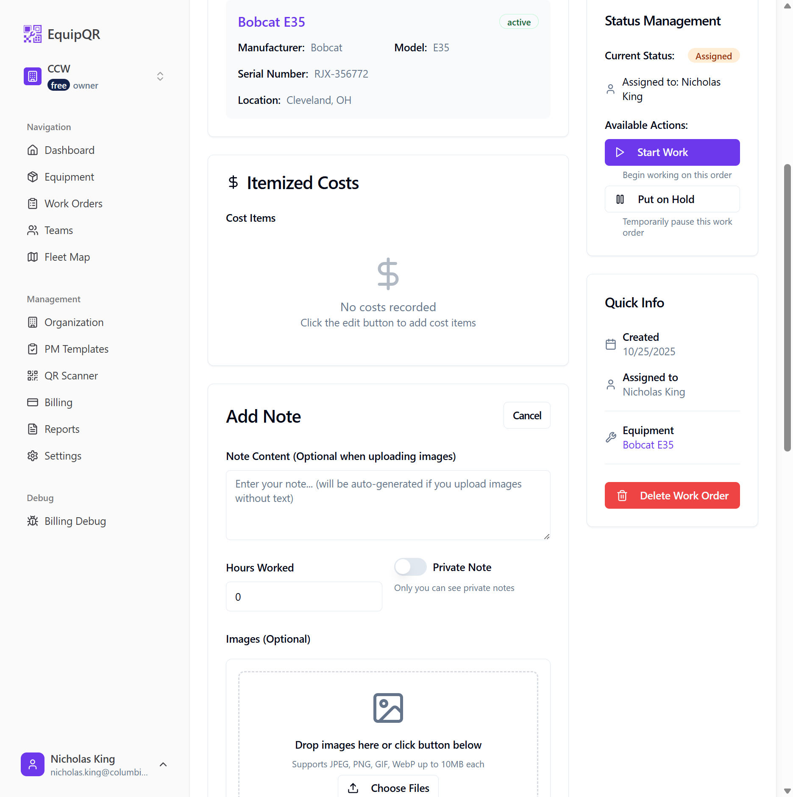
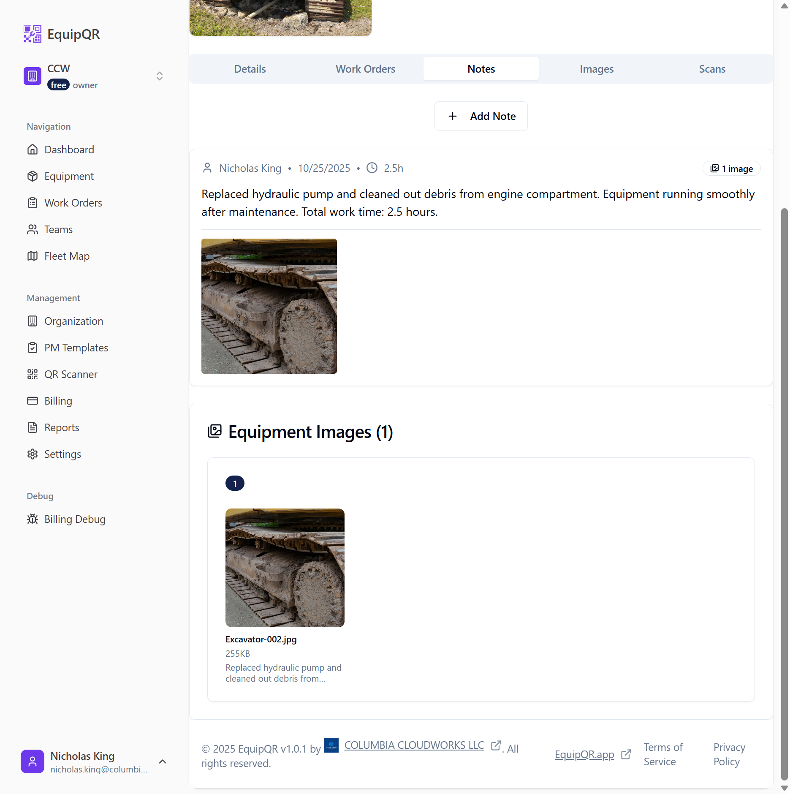

# Technician Guide: Uploading Images to Equipment Records

## Overview

This guide provides step-by-step instructions for technicians on how to upload images to equipment records in EquipQR™. Images are uploaded through work orders, which allows for proper documentation of maintenance work, damage assessment, and repair progress.

## Prerequisites

- Access to EquipQR™ mobile app or web interface
- Equipment QR code scanned or equipment ID available
- Camera or image files ready for upload
- Valid technician account with appropriate permissions

## Step-by-Step Process

### Step 1: Access the Equipment Record

1. **Scan the QR Code** on the equipment using the EquipQR™ mobile app
2. **Or navigate directly** to the equipment page if you have the equipment ID
3. The equipment page will display basic information about the machine

*Figure 1: Initial equipment page showing basic information*

### Step 2: Create a Work Order

1. Click on the **"Work Orders"** tab in the equipment page
2. Click **"Create Work Order"** or **"Create First Work Order"** button
3. Fill out the work order details:
   - **Title**: Enter a descriptive title (e.g., "Hydraulic System Repair - Track Replacement")
   - **Priority**: Select appropriate priority level
   - **Description**: Provide detailed description of the work needed

*Figure 2: Creating a new work order*

### Step 3: Upload Images with Notes

1. After creating the work order, scroll down to the **"Add Your First Note"** section
2. Fill in the note details:
   - **Note Content**: Describe what you found, what you did, and any important observations
   - **Hours Worked**: Enter the time spent on the work
   - **Private Note**: Toggle if this note should only be visible to you

3. **Upload Images**:
   - In the **"Images (Optional)"** section, click **"Choose Files"**
   - Select one or more images from your device
   - Images will be automatically uploaded when you save the note

*Figure 3: Uploading images with detailed notes*

### Step 4: Set Display Image for Equipment

1. After uploading images, go to the **"Images"** tab in the equipment page
2. Find the image you want to use as the main display image
3. Click the **"Set as Display Image"** button on the desired image
4. The image will now appear as the main equipment photo

*Figure 4: Setting an image as the equipment display photo*

## Working with PM Checklists

### Step 5: Create a PM Checklist Work Order

1. When creating a work order, check the **"Include PM Checklist"** option
2. Select a PM template (e.g., "Forklift PM Checklist")
3. The work order will include a comprehensive maintenance checklist

*Figure 5: Creating a work order with PM checklist*

### Step 6: Complete PM Checklist Items

1. In the work order details, scroll to the **"PM Checklist"** section
2. Click **"Set All to OK"** to quickly mark all items as acceptable
3. For items that need attention:
   - Select the appropriate status (Needs Attention, Critical, etc.)
   - Add detailed notes explaining the issue
   - Upload photos showing the problem

*Figure 6: Completing PM checklist items with notes and photos*

### Step 7: Save Progress

1. Click **"Save Changes"** after updating checklist items
2. The system will auto-save your progress
3. You can return to the checklist later to continue work

*Figure 7: Saving PM checklist progress*

## Managing Work Order Status

### Step 8: Update Work Order Status

1. In the work order details, find the **"Status"** section
2. Click the status dropdown to change the work order status:
   - **Pending**: Work order created but not started
   - **In Progress**: Work is currently being performed
   - **Completed**: All work finished
   - **Cancelled**: Work order cancelled

*Figure 8: Updating work order status*

## Adding Items and Costs

### Step 9: Add Parts and Costs

1. In the work order details, scroll to the **"Costs"** section
2. Click **"Add Item"** to add parts or services
3. Fill in the details:
   - **Item Name**: Name of the part or service
   - **Quantity**: Number of items used
   - **Unit Cost**: Cost per item
   - **Description**: Additional details

*Figure 9: Adding parts and costs to work order*

## Private Notes

### Step 10: Add Private Notes

1. When adding a note, toggle the **"Private Note"** option
2. Private notes are only visible to you and other technicians
3. Use private notes for:
   - Internal observations
   - Personal reminders
   - Sensitive information

*Figure 10: Adding private notes that customers won't see*

## Viewing All Equipment Images

### Step 11: Access Equipment Image Gallery

1. Go to the **"Images"** tab in the equipment page
2. View all images uploaded through work orders and equipment notes
3. Images are organized by date and source
4. Click on any image to view it in full size

*Figure 11: Viewing all equipment images in the gallery*

## Troubleshooting

### Images Not Appearing in Gallery

If images uploaded through work orders don't appear in the equipment Images tab:

1. Check that the work order is properly saved
2. Verify the image upload completed successfully
3. Refresh the page to see updated images
4. Contact your administrator if the issue persists

### Upload Issues

If you're having trouble uploading images:

1. Check your internet connection
2. Ensure images are in supported formats (JPG, PNG, GIF)
3. Try reducing image file size if uploads are slow
4. Contact support if problems continue

## Best Practices

1. **Always add descriptive notes** with your images
2. **Use clear, well-lit photos** that show the issue clearly
3. **Include multiple angles** for complex problems
4. **Set the best image as the display photo** for easy identification
5. **Use private notes** for sensitive information
6. **Save your work frequently** to avoid losing progress

## Support

If you need help with image uploads or any other EquipQR™ features:

- Check this guide first
- Contact your team lead or administrator
- Submit a support ticket through the app
- Review the full EquipQR™ documentation

---

*This guide is designed for technicians with basic computer skills. If you need additional assistance, don't hesitate to ask for help.*
