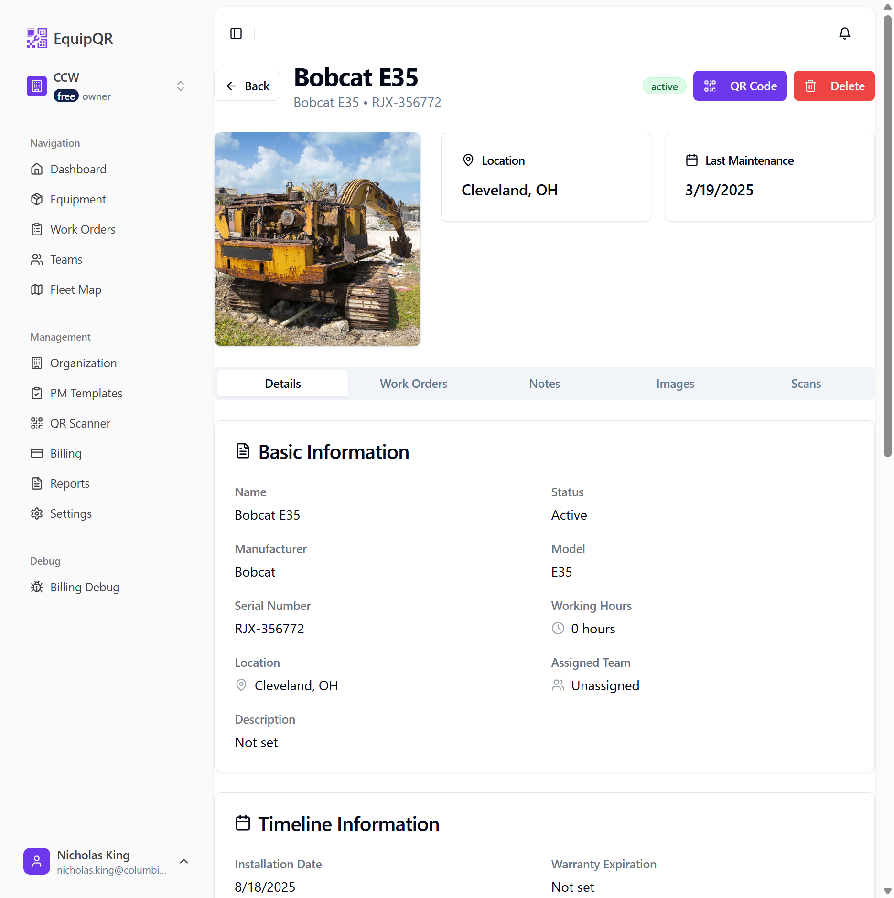
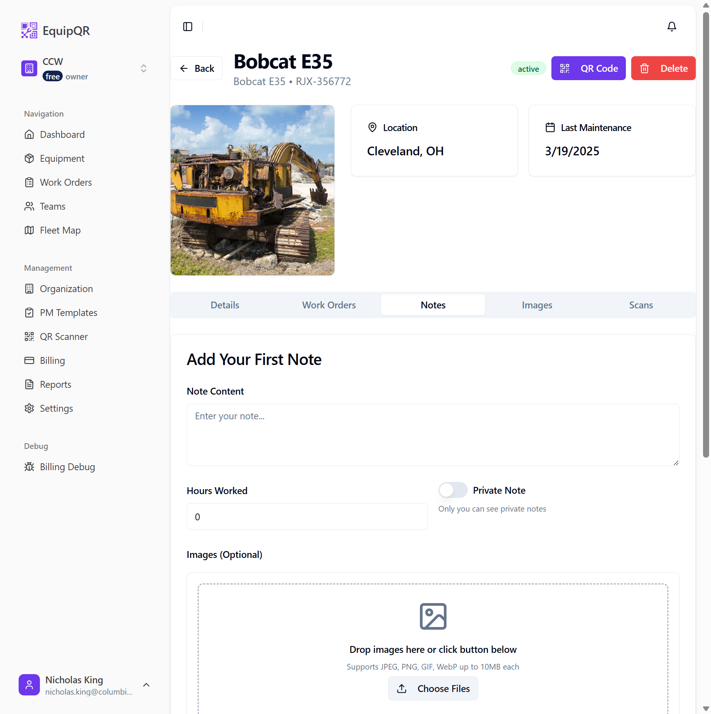
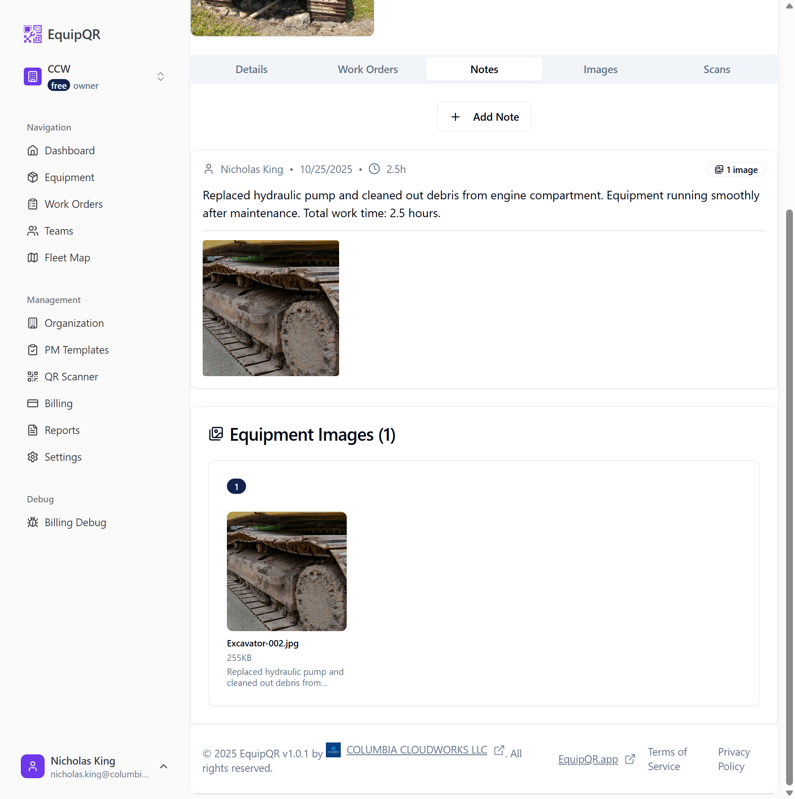
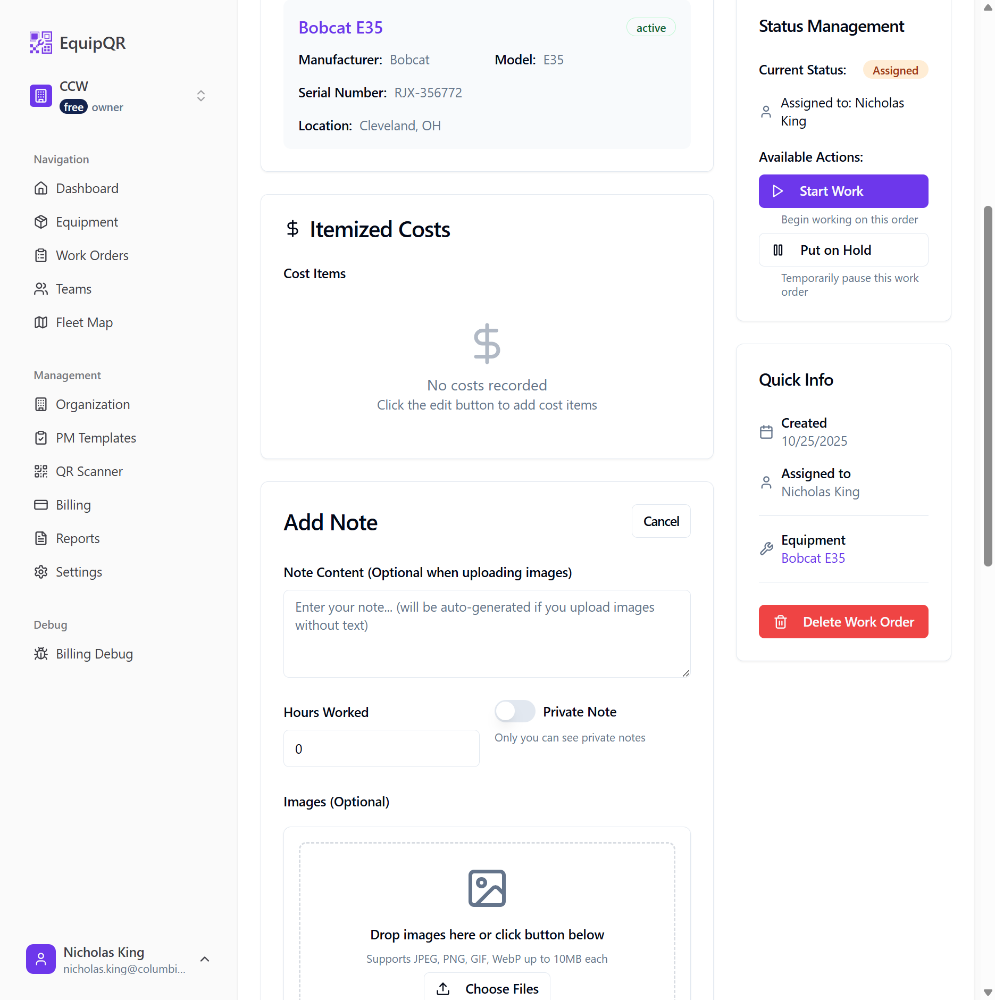
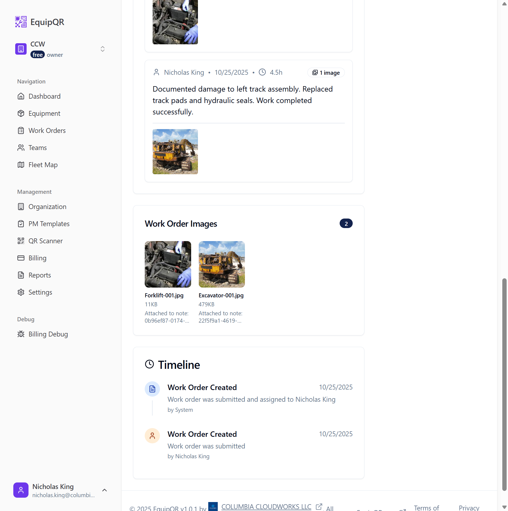
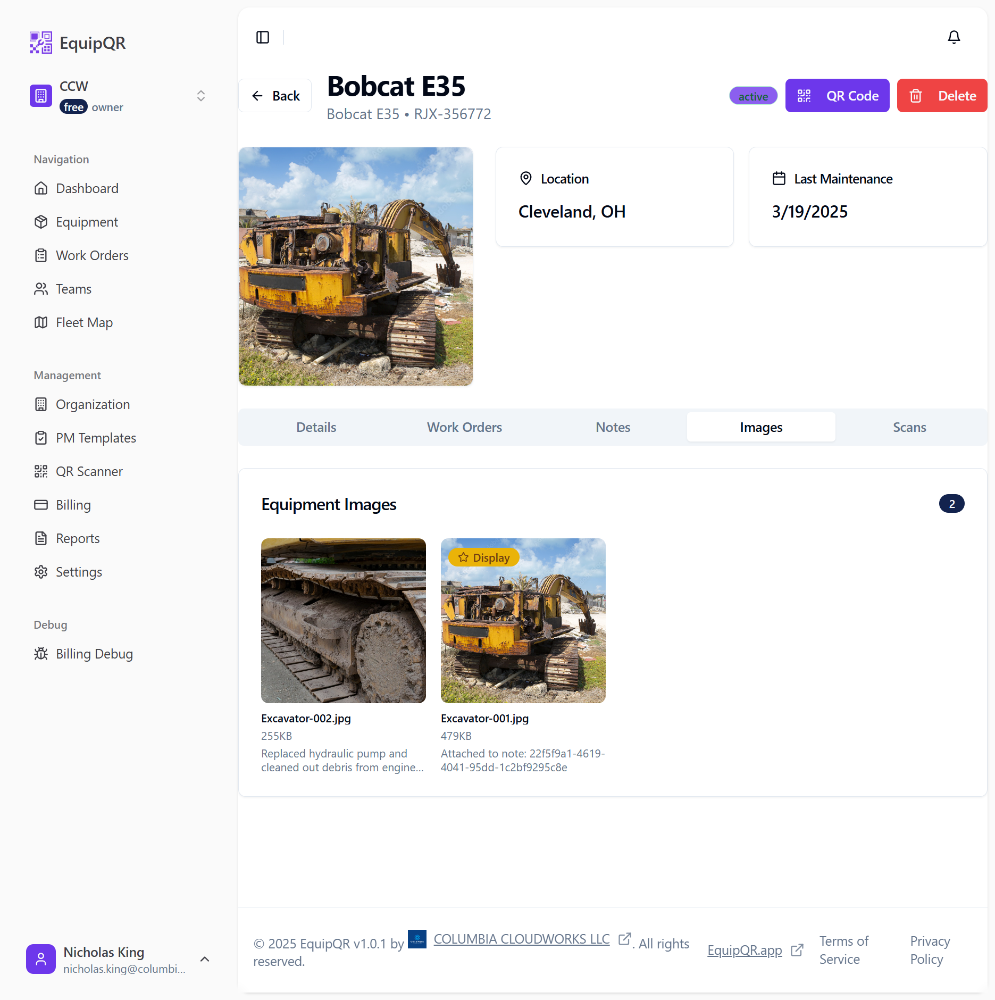

# Technician Image Upload Guide

## Overview

This guide provides step-by-step instructions for technicians on how to upload images to equipment records in EquipQR. Images can be uploaded through either equipment notes or work orders, and they will appear in the equipment's Images tab for easy reference.

## Prerequisites

- Access to EquipQR mobile app or web interface
- Equipment QR code or direct link to equipment record
- Images ready for upload (JPEG, PNG, GIF, WebP formats supported)
- Maximum file size: 10MB per image

## Method 1: Uploading Images via Equipment Notes

### Step 1: Access the Equipment Record

1. Scan the QR code on the equipment or navigate to the equipment record
2. You'll see the equipment details page with several tabs

### Step 2: Navigate to Notes Tab

1. Click on the **"Notes"** tab in the equipment record
2. You'll see the notes interface with an image upload area

### Step 3: Prepare Your Note

1. **Note Content**: Enter a description of the work performed
   - Example: "Replaced hydraulic pump and cleaned out debris from engine compartment. Equipment running smoothly after maintenance. Total work time: 2.5 hours."

2. **Hours Worked**: Enter the number of hours spent on the work
   - Use the spinbutton to set the correct number of hours

3. **Private Note**: Toggle this if you want the note to be visible only to you

### Step 4: Upload Images

1. In the **"Images (Optional)"** section, you can either:
   - **Drag and drop** images directly onto the upload area
   - **Click "Choose Files"** to select images from your device

2. Select your image files (supports JPEG, PNG, GIF, WebP up to 10MB each)
3. The selected images will appear in the "Selected Images" section
4. Click **"Upload 1 Image"** (or the appropriate number) to upload the images

### Step 5: Complete the Upload

1. After clicking upload, the image will be processed and attached to your note
2. The note will be created with the image embedded
3. The image will automatically appear in the equipment's Images tab

## Method 2: Uploading Images via Work Orders

### Step 1: Access the Work Order

1. Navigate to the work order you're assigned to
2. Click **"View Details"** to open the work order details page

### Step 2: Add a Note with Images

1. Click the **"Add Note"** button in the work order
2. Fill in the note content describing your work
3. Use the same image upload process as described in Method 1

### Step 3: Upload and Submit

1. Select your images and click **"Upload 1 Image"**
2. The image will be attached to the work order note
3. The image will appear in the work order's image gallery

## Viewing Uploaded Images

### Equipment Images Tab

1. Navigate to the equipment record
2. Click on the **"Images"** tab
3. All images uploaded through notes or work orders will be displayed here

### Image Information

Each image shows:
- **Filename**: The original name of the uploaded file
- **File size**: Size of the uploaded image
- **Description**: The note content that was attached with the image
- **Actions**: Options to view, download, or manage the image

## Best Practices

### Image Quality
- Use good lighting when taking photos
- Ensure the image clearly shows the work performed or damage documented
- Take multiple angles if necessary to fully document the situation

### Documentation
- Always include descriptive text with your images
- Record the exact time spent on work
- Be specific about what was replaced, repaired, or inspected

### File Management
- Keep file sizes reasonable (under 10MB)
- Use descriptive filenames when possible
- Upload images immediately after completing work

## Troubleshooting

### Common Issues

**Image won't upload:**
- Check file size (must be under 10MB)
- Verify file format (JPEG, PNG, GIF, WebP only)
- Ensure stable internet connection

**Image not appearing in Images tab:**
- Images uploaded through equipment notes should appear immediately
- Images uploaded through work orders may take a moment to sync
- Refresh the page if images don't appear after a few minutes

**Preview not working:**
- This is a known issue with image previews in the upload interface
- Images will still upload successfully despite preview errors
- Check the Images tab to confirm successful upload

### Getting Help

If you encounter issues:
1. Try refreshing the page
2. Check your internet connection
3. Contact your supervisor or IT support
4. Document the issue with screenshots if possible

## Important Notes

- **Work Order Images**: Currently, images uploaded through work orders may not immediately appear in the equipment's Images tab. This is a known issue that is being addressed.
- **Image Storage**: All images are securely stored and associated with the specific equipment record
- **Access Control**: Images follow the same access permissions as the equipment record
- **Backup**: Images are automatically backed up as part of the system's data protection

## Summary

Uploading images to equipment records is a straightforward process that helps maintain detailed maintenance records. Whether you use equipment notes or work orders, the images will be preserved as part of the equipment's history and can be referenced by other technicians and management.

Remember to:
1. Take clear, well-lit photos
2. Include descriptive text with your images
3. Record accurate time spent on work
4. Upload images promptly after completing work

This documentation ensures that all technicians can effectively document their work and maintain comprehensive equipment records.
