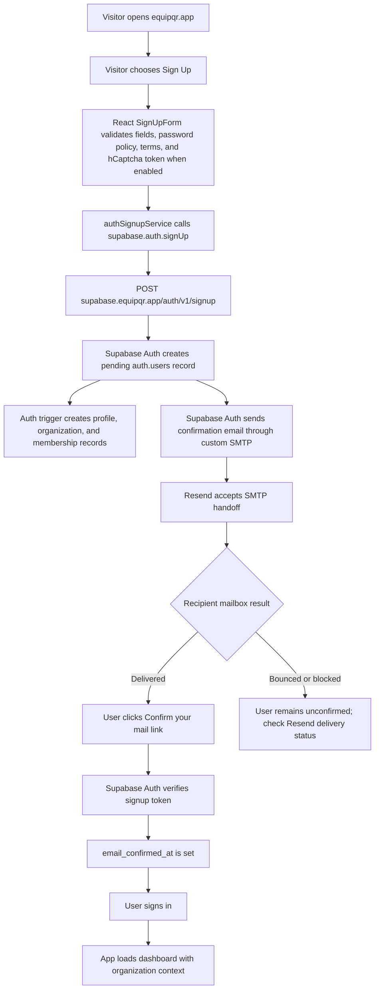

# EquipQR Production Signup Email Workflow

Last verified: 2026-05-25 UTC

This runbook documents the production email signup path after the Resend SMTP cutover. It is intended to be printable and readable without needing access to secrets.

## Current Production Configuration

| Component | Production value |
| --- | --- |
| App URL | `https://equipqr.app` |
| Supabase project | `ymxkzronkhwxzcdcbnwq` |
| Supabase Auth URL | `https://supabase.equipqr.app/auth/v1` |
| Supabase Auth email sender | `EquipQR <noreply@equipqr.app>` |
| SMTP provider | Resend |
| SMTP host | `smtp.resend.com` |
| SMTP port | `587` |
| SMTP username | `resend` |
| Resend sending domain | `equipqr.app` |
| Resend domain status | Verified, sending enabled |
| Auth email rate limit | `30` emails per hour |
| Per-recipient SMTP frequency | `60` seconds |
| Email confirmation | Required |

Secrets are not stored in this document. The SMTP password is a Resend API key configured in Supabase Auth settings. The app's separate Edge Function `RESEND_API_KEY` remains managed through 1Password-backed Supabase secrets.

## Workflow Diagram

## Numbered Flow

1. A user visits `https://equipqr.app` and opens the signup tab.
2. `SignUpForm` validates required fields, password complexity, terms acceptance, and the hCaptcha token when the site key is enabled.
3. `SignUpForm` calls `signUpWithEmail()` in `src/services/authSignupService.ts`.
4. `signUpWithEmail()` calls `supabase.auth.signUp()` with:
   - the submitted email and password,
   - redirect URL `https://equipqr.app/`,
   - user metadata including name, organization name, and legal acceptance intent.
5. Supabase Auth receives `POST /auth/v1/signup`.
6. Supabase creates an unconfirmed `auth.users` row.
7. The new-user database trigger creates the application-side profile, personal organization, and organization membership records.
8. Supabase Auth sends the confirmation email through the configured Resend SMTP server.
9. Resend accepts the SMTP handoff and records the message under transactional emails.
10. The recipient mailbox either accepts or rejects the email.
11. When the user clicks the confirmation link, Supabase verifies the signup token and sets `auth.users.email_confirmed_at`.
12. The user signs in normally and the app loads the dashboard with organization context.

## Verification Checklist

Use this checklist after any Auth, SMTP, DNS, or signup-flow change.

1. Confirm Supabase Auth config:
   - `external_email_enabled = true`
   - `smtp_host = smtp.resend.com`
   - `smtp_port = 587`
   - `smtp_admin_email = noreply@equipqr.app`
   - `smtp_sender_name = EquipQR`
   - `rate_limit_email_sent = 30`
   - `mailer_autoconfirm = false`
2. Confirm Resend domain health:
   - `equipqr.app` is verified.
   - Sending is enabled.
   - Open and click tracking can remain disabled.
3. Submit one fresh production signup with a real inbox.
4. In Supabase Auth logs, confirm the newest `/signup` request returns `200`.
5. In Resend, confirm a new email with subject `Confirm Your Signup` appears.
6. Confirm Resend status becomes `delivered`.
7. Click the confirmation link from the inbox.
8. Confirm the user can sign in and reaches the dashboard.
9. Confirm `auth.users.email_confirmed_at` is no longer `NULL` for that email.

## Known Failure Modes

| Symptom | Meaning | Next check |
| --- | --- | --- |
| `/signup` returns `429` with `over_email_send_rate_limit` | Supabase Auth email limiter blocked the request | Check `rate_limit_email_sent` and recent signup volume |
| `/signup` returns `429` with a short cooldown message | Same recipient requested another email too quickly | Wait at least `60` seconds before retrying that address |
| Resend status is `bounced` | Supabase and Resend worked, but recipient delivery failed | Test another inbox and inspect Resend delivery details |
| User exists but `email_confirmed_at` is `NULL` | Signup succeeded but confirmation was not completed | Confirm delivery, then have user click the email link |
| `/signup` returns `500` with database trigger errors | Auth created the user but app-side trigger failed | Inspect production Auth logs and the relevant database function body |
| Confirmation email does not appear in Resend | Supabase did not hand off to Resend SMTP | Re-check Supabase Auth SMTP settings and API reload timing |

## Important Boundaries

- Resend SMTP for Supabase Auth is separate from Edge Function email sending. Edge Functions use `RESEND_API_KEY` from Supabase secrets and currently send invitations through `supabase/functions/send-invitation-email`.
- Do not paste confirmation links, signup tokens, SMTP passwords, or Resend API keys into chat, commits, screenshots, or documentation.
- A Resend bounce is not the same as a Supabase signup failure. If Supabase returns `200` and Resend records the message, the signup system is functioning and the issue is recipient deliverability.
- Do not turn on `mailer_autoconfirm` for production. Email confirmation is part of the intended account verification flow.

## Hardening Follow-Up

Supabase Auth CAPTCHA is currently the next useful hardening step. The frontend already supports hCaptcha token collection when `VITE_HCAPTCHA_SITEKEY` is present; Supabase Auth should also have CAPTCHA verification enabled so Auth itself enforces the token before accepting signup attempts.
